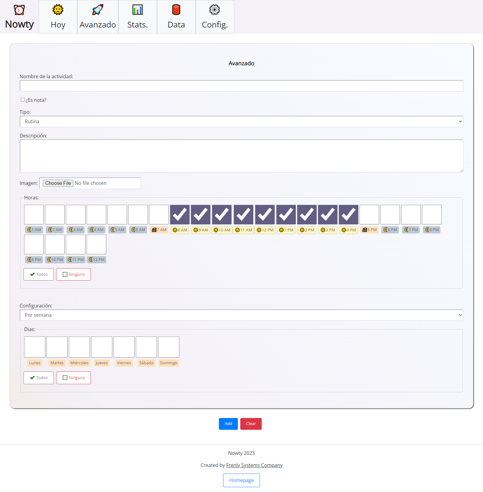

# ⏰ Nowty

Nowty is an application that I use to manage daily activities, including routines, punctual tasks, and time-bound activities. It helps me organize my schedule and track completed tasks.

## 🚀 Technologies Used

The app is built using React, ExpressJS and MySQL.

## 🌟 Features

- **Activity Tracking:** Easily manage daily tasks and routines.
- **Notes:** Add comments and reminders to your activities.
- **Quick Entry:** Rapidly add new activities.
- **Advanced Entry:** Detailed input for complex tasks.
- **Routine Creation:** Weekly or monthly routines.

## Screenshots

  

## 🤔 Challenges

Transitioning from vanilla JavaScript to React for the frontend was challenging. Adapting an existing app required careful planning and learning, but it was a rewarding process.

## 🔮 Future Work

- **Statistics:** For better insights.
- **Improved Configuration:** More personalization options.

👷 Please note that it is a work in progress. There is no demo available. 